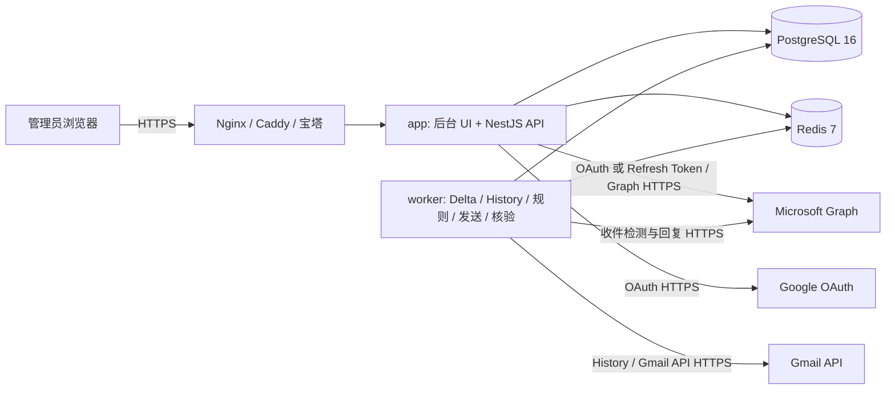

# MailPilot — Microsoft 与 Gmail 邮箱自动回复系统

当前版本：**v0.06**

[](https://github.com/a06342637/Email-reply/actions/workflows/ci.yml)

MailPilot 是一套面向 Debian 12/13 的 Docker 化邮箱自动回复系统。它通过 Microsoft Graph 或 Gmail API 检测 Outlook、Hotmail、全球版 Microsoft 365、Gmail 和 Google Workspace 邮箱的新邮件，并根据模板和规则自动执行普通 Reply。

系统不使用 IMAP/SMTP，不保存邮箱密码。收件、发件和 OAuth 都通过 HTTPS 访问 Microsoft 或 Google 官方 API，因此服务器无需开放 993、465 或 587 端口。

> v0.06 已完成代码级、类型、构建、自动化测试和本地 UI 冒烟测试，并修复 Microsoft Graph 回复附件查询兼容性问题。正式投入使用前，仍应使用你自己的 Microsoft/Google 凭据、测试邮箱和 Debian 服务器完成本文末尾的真实环境验收。

## 目录

- [主要功能](#主要功能)
- [v0.06 支持范围](#v006-支持范围)
- [系统架构](#系统架构)
- [网络与服务器要求](#网络与服务器要求)
- [Debian 一键安装](#debian-一键安装)
- [配置域名和 HTTPS](#配置域名和-https)
- [注册 Microsoft Entra 应用](#注册-microsoft-entra-应用)
- [注册 Google Cloud Gmail 应用](#注册-google-cloud-gmail-应用)
- [首次登录](#首次登录)
- [连接邮箱](#连接邮箱)
- [创建回复模板](#创建回复模板)
- [创建自动回复任务](#创建自动回复任务)
- [规则匹配说明](#规则匹配说明)
- [暂停、恢复和删除](#暂停恢复和删除)
- [自动回复安全机制](#自动回复安全机制)
- [日志、告警和 Webhook](#日志告警和-webhook)
- [管理员安全与 TOTP](#管理员安全与-totp)
- [备份与恢复](#备份与恢复)
- [常用运维命令](#常用运维命令)
- [升级与回滚](#升级与回滚)
- [常见问题](#常见问题)
- [安全建议](#安全建议)
- [开发与测试](#开发与测试)
- [真实环境验收清单](#真实环境验收清单)
- [版本规则](#版本规则)

## 主要功能

- 支持合计 1–10 个 Microsoft 与 Google 邮箱。
- Microsoft 支持 Outlook/Hotmail 个人邮箱和全球版 Microsoft 365 用户邮箱。
- Google 支持 Gmail 个人邮箱和 Google Workspace 用户邮箱。
- Microsoft 邮箱支持 OAuth 2.0 Authorization Code + PKCE 网页登录（推荐），也支持 Client ID + Refresh Token 高级导入。
- 使用加密的 MSAL Token Cache、Microsoft Refresh Token Cache 或 Google Refresh Token 自动续期，不保存邮箱登录密码。
- Microsoft 分别检测 inbox 与 junkemail；Gmail 分别识别 INBOX 与 SPAM。
- 检测周期最低可设置为 3 秒；这是尽力而为周期，不是硬实时承诺。
- 每封合格新邮件最多回复一次；同一会话后续新邮件仍可分别回复。
- 每个邮箱一个自动回复任务，任务支持多条优先级规则。
- 支持发件人地址、发件人域名、主题和所在文件夹规则。
- 支持富文本、HTML、Liquid 变量、条件语句、内嵌图片和固定附件。
- 模板采用草稿、发布和版本修订模式。
- 暂停期间不发送，恢复后从 Microsoft Delta Link 或 Gmail History ID 补处理积压邮件。
- PostgreSQL 事务 Outbox、BullMQ、Redis 锁和发送限速防止丢任务或并发重复发送。
- 通过草稿 ID、追踪头和已发送邮件核验处理发送超时，避免盲目重发。
- 管理后台支持暗色、亮色和跟随系统三态主题。
- 支持处理日志、系统日志、审计日志、告警、CSV/JSON 导出和签名 Webhook。
- 仪表盘按邮件发现时间和最终完成时间分别统计最近 24 小时与 7 天数据。
- 支持 Argon2id + XChaCha20-Poly1305 加密备份与跨服务器恢复。
- 提供 Debian 安装脚本、改密 CLI、健康检查和升级回滚脚本。

## v0.06 支持范围

支持：

- Outlook.com、Hotmail.com、Live.com 等个人 Microsoft 邮箱。
- 全球版 Microsoft 365 普通用户邮箱。
- Gmail 个人邮箱。
- Google Workspace 普通用户邮箱。
- Debian 12 和 Debian 13。
- 单实例部署，建议管理 1–10 个邮箱。

暂不支持：

- 共享邮箱。
- Microsoft 365 中国世纪互联版。
- 工作时间、星期计划或定时启停。
- IMAP、POP3、SMTP 模式。
- 多管理员和开放注册。

## 系统架构



Docker Compose 包含：

- **app**：管理后台、REST API、登录、系统设置、SSE 和监控。
- **worker**：邮件轮询、规则匹配、模板渲染、草稿发送和发送核验。
- **migrate**：启动前执行 Prisma 数据库迁移的一次性容器。
- **postgres**：业务数据、游标、去重、日志、审计和事务 Outbox。
- **redis**：BullMQ 队列、分布式锁和发送限速，启用 AOF。

PostgreSQL 和 Redis 不映射宿主机公网端口。app 默认监听宿主机 `0.0.0.0:8080`，安装后可直接通过服务器 IP 和端口访问后台。

## 网络与服务器要求

建议配置：

- Debian 12/13 x86_64 或 arm64。
- 2 核 CPU。
- 2 GB 内存起步，推荐 4 GB。
- 至少 10 GB 可用磁盘空间。
- 如需使用 Microsoft/Google OAuth 网页授权，需要一个解析到服务器公网 IP 的域名和可用的 HTTPS 证书。

入站端口：

- 22：SSH，仅开放给可信 IP 更安全。
- 80：申请证书和 HTTP 跳转。
- 443：后台、Microsoft OAuth 和 Google OAuth 回调。
- 8080：默认绑定 `0.0.0.0`，可通过 `http://服务器IP:8080` 访问；建议使用主机防火墙或云安全组限制可信来源。

出站要求：

- 允许 TCP 443。
- 能访问 login.microsoftonline.com。
- 能访问 graph.microsoft.com。
- 能访问 Microsoft 登录和 CDN 相关域名。
- 能访问 accounts.google.com 和 oauth2.googleapis.com。
- 能访问 gmail.googleapis.com 和 openidconnect.googleapis.com。

不需要开放：

- IMAP 993。
- SMTP 465、587 或 25。
- PostgreSQL 5432。
- Redis 6379。

## Debian 一键安装

### 1. 下载项目

```bash
sudo apt update
sudo apt install -y git
git clone https://github.com/a06342637/Email-reply.git
cd Email-reply
chmod +x install.sh update.sh
```

### 2. 运行安装程序

```bash
sudo ./install.sh
```

安装脚本会：

1. 检查系统是否为 Debian 12/13。
2. 安装 CA 证书、curl、jq、OpenSSL 和必要工具。
3. 缺少 Docker 时，使用 Docker 官方 Debian 软件源安装 Docker Engine、Buildx 和 Compose Plugin。
4. 生成 PostgreSQL 密码、实例主密钥和会话密钥。
5. 构建并启动全部容器。
6. 从 VERSION 自动写入应用和镜像版本号，并等待 app、Redis、PostgreSQL 和 worker 通过健康检查。

安装时会询问：

- **HTTPS 公开地址**：例如 https://mail.example.com。可以暂时留空；留空时不能使用 Microsoft/Gmail OAuth 网页登录，但仍可通过 Client ID + Refresh Token 导入 Microsoft 邮箱。
- **本机监听端口**：默认 8080。
- **管理员用户名**：直接回车会随机生成。
- **管理员密码**：直接回车会随机生成；手工输入至少 12 位。

随机生成的用户名或密码会：

- 在安装终端显示一次。
- 在 app 首次 Docker 日志中显示一次。
- 随机密码登录后强制修改。

手工输入的管理员密码不会写入 Docker 日志。

安装脚本检测到已有 .env 时会停止，避免覆盖数据库密码和实例主密钥。升级已有实例请使用 update.sh。

安装完成后可直接打开：

```text
http://服务器公网IP:8080
```

例如服务器 IP 为 `168.110.210.195` 时，访问 `http://168.110.210.195:8080`。IP 直连是明文 HTTP，只适合首次配置、临时使用或已由防火墙限制来源的环境；Microsoft/Google OAuth 网页授权仍必须配置 HTTPS 域名。

IP 直连模式默认使用 `PUBLIC_URL=` 和 `TRUST_PROXY=0`。不要在 8080 仍直接暴露公网时把 `TRUST_PROXY` 改为 `1`，否则客户端可伪造转发 IP 请求头。

### 3. 检查运行状态

```bash
docker compose ps
docker compose logs --tail=100 app worker migrate
curl -fsS http://127.0.0.1:8080/health/live
curl -fsS http://127.0.0.1:8080/health/ready
```

正常情况下：

- migrate 状态为 Exited (0)。
- app 和 worker 状态为 healthy。
- health/live 返回存活状态。
- health/ready 返回 PostgreSQL、Redis 和 Worker 就绪状态。

## 配置域名和 HTTPS

Microsoft 与 Google OAuth 回调都必须使用可从浏览器访问的 HTTPS 域名。后台虽然可直接通过 `http://服务器IP:8080` 打开，但生产环境建议改用 HTTPS 域名。

下面以 Nginx 和域名 mail.example.com 为例。

反向代理启用后修改 `.env`：

```dotenv
HOST_BIND=127.0.0.1
PUBLIC_URL=https://mail.example.com
TRUST_PROXY=1
```

然后重建 app 容器：

```bash
docker compose up -d --force-recreate app
```

### 1. 配置 DNS

在域名服务商处添加 A 记录：

```text
mail.example.com -> 你的 Debian 服务器公网 IPv4
```

如使用 IPv6，再添加 AAAA 记录。

等待解析生效：

```bash
getent hosts mail.example.com
```

### 2. 安装 Nginx 和 Certbot

```bash
sudo apt update
sudo apt install -y nginx certbot python3-certbot-nginx
```

### 3. 创建反向代理

创建 /etc/nginx/sites-available/mailpilot：

```nginx
server {
    listen 80;
    listen [::]:80;
    server_name mail.example.com;

    # 备份恢复最大 512 MB，额外空间用于 multipart 封装。
    # 模板附件仍受应用自身 25 MB 硬上限约束。
    client_max_body_size 520m;

    location / {
        proxy_pass http://127.0.0.1:8080;
        proxy_http_version 1.1;
        proxy_set_header Host $host;
        proxy_set_header X-Real-IP $remote_addr;
        proxy_set_header X-Forwarded-For $proxy_add_x_forwarded_for;
        proxy_set_header X-Forwarded-Proto $scheme;
        proxy_set_header X-Forwarded-Host $host;
        proxy_set_header Connection "";
        proxy_read_timeout 300s;
        proxy_send_timeout 300s;
        proxy_buffering off;
    }
}
```

启用配置：

```bash
sudo ln -s /etc/nginx/sites-available/mailpilot /etc/nginx/sites-enabled/mailpilot
sudo nginx -t
sudo systemctl reload nginx
```

### 4. 申请 HTTPS 证书

```bash
sudo certbot --nginx -d mail.example.com
```

选择将 HTTP 自动跳转到 HTTPS。

项目还提供了完整参考配置：

- [nginx/autoreply.conf.example](nginx/autoreply.conf.example)

配置完成后访问：

```text
https://mail.example.com
```

如果安装时没有填写公开地址，登录后台后进入：

**系统设置 → Microsoft（或 Google / Gmail）→ HTTPS 公开地址**

填写 https://mail.example.com 并保存。

## 注册 Microsoft Entra 应用

本节用于推荐的 **OAuth 网页登录** 方式。只需要创建一套 Microsoft Web 应用，之后可用它连接 1–10 个邮箱。

如果已经持有与某个 Microsoft 公共客户端匹配的 Client ID 和 Refresh Token，也可以跳到“连接邮箱”章节使用高级导入，不必把这套 Client ID/Secret 保存为系统级 OAuth 配置。

### 1. 新建应用注册

打开：

- [Microsoft Entra 管理中心](https://entra.microsoft.com/)

进入：

**Identity → Applications → App registrations → New registration**

建议名称：

```text
MailPilot Auto Reply
```

支持的账户类型必须选择：

**Accounts in any organizational directory and personal Microsoft accounts**

中文界面通常显示：

**任何组织目录中的账户和个人 Microsoft 账户**

这一项决定应用能否同时授权个人 Outlook/Hotmail 和 Microsoft 365 邮箱。

### 2. 配置回调地址

平台选择 **Web**，重定向 URI 填写：

```text
https://你的域名/api/v1/microsoft/oauth/callback
```

例如：

```text
https://mail.example.com/api/v1/microsoft/oauth/callback
```

注意：

- 必须是 HTTPS。
- 域名必须与后台公开地址一致。
- 路径必须完全一致。
- 不要随意增加结尾斜杠。

### 3. 添加委托权限

进入：

**API permissions → Add a permission → Microsoft Graph → Delegated permissions**

添加：

| 权限           | 用途                         |
| -------------- | ---------------------------- |
| openid         | OpenID 登录标识              |
| profile        | 获取基础账户资料             |
| offline_access | 获取可长期刷新的授权         |
| User.Read      | 读取当前授权用户             |
| Mail.ReadWrite | 检测邮件、创建和管理回复草稿 |
| Mail.Send      | 发送回复邮件                 |

MailPilot 使用的是 **Delegated permissions**，不是 Application permissions。

企业租户可能禁止用户自行同意。此时需要租户管理员执行 Grant admin consent，或批准用户发起的授权请求。

### 4. 创建 Client Secret

进入：

**Certificates & secrets → Client secrets → New client secret**

创建后立即复制 **Value**。

不要复制 Secret ID。离开页面后 Value 通常无法再次显示。

建议同时记录到期日期，后台会在到期前 30、7、1 天产生告警。

### 5. 复制 Client ID

回到 Overview，复制：

**Application (client) ID**

本系统不要求手工填写 Tenant ID，因为授权入口使用同时支持个人账户和企业账户的 common authority。

### 6. 填入 MailPilot

登录后台，进入：

**系统设置 → Microsoft**

填写：

- Client ID。
- Client Secret Value。
- Secret 到期日期。
- HTTPS 公开地址。

保存后 Client Secret 不会再次显示原文，只能替换。

修改这里的 Client ID 只会使使用 **OAuth 网页登录** 的 Microsoft 邮箱进入需要重新授权状态；使用独立 Client ID + Refresh Token 导入的邮箱不受影响。仅替换同一应用的 Client Secret 时，系统会先尝试静默刷新 OAuth 邮箱。

## 注册 Google Cloud Gmail 应用

只需要创建一套 Google OAuth Web 应用，之后可用它连接 Gmail 个人邮箱或 Google Workspace 用户邮箱。

### 1. 创建或选择 Google Cloud 项目

打开：

- [Google Cloud Console](https://console.cloud.google.com/)

创建一个新项目，或选择专门用于 MailPilot 的现有项目。建议不要与无关生产系统共用 OAuth 客户端。

### 2. 启用 Gmail API

进入：

**APIs & Services → Library → Gmail API → Enable**

如果 Gmail API 未启用，OAuth 可能成功，但读取 History、创建草稿或发送邮件会返回 `accessNotConfigured` 或 403。

### 3. 配置 OAuth 同意屏幕

进入：

**Google Auth Platform → Branding / Audience / Data Access**

按用途选择受众：

- 仅 Google Workspace 组织内部使用：可选择 **Internal**。
- Gmail 个人账户或组织外账户：选择 **External**。

填写应用名称、支持邮箱和开发者联系邮箱。自用或测试阶段，把需要连接的 Gmail 地址加入 **Test users**。

MailPilot 请求以下权限：

| 权限                   | 用途                                                                                                                            |
| ---------------------- | ------------------------------------------------------------------------------------------------------------------------------- |
| openid、email、profile | 识别授权账户和显示名称                                                                                                          |
| `gmail.readonly`       | Google 会授予 Gmail 邮件只读权限；MailPilot 实际只请求检测所需的元数据、邮件头、INBOX/SPAM 标签和 History，不保存来信正文或附件 |
| `gmail.compose`        | 创建带 HTML、纯文本、内嵌图片和附件的回复草稿，并发送草稿                                                                       |

这些 Gmail 权限包含 Google 受限权限。若应用要公开给大量外部用户使用，Google 可能要求完成 OAuth 应用验证和安全评估；本项目无法替你完成 Google 的品牌、域名所有权或合规审核。

> 重要：External 应用处于 **Testing** 状态时，包含 Gmail 受限权限的刷新令牌通常只有 7 天有效期。长期无人值守运行前，应按 Google 要求发布到 Production，或使用组织内部应用，并完成可能要求的验证。

### 4. 创建 OAuth Web Client

进入：

**Google Auth Platform → Clients → Create Client → Web application**

建议名称：

```text
MailPilot Auto Reply
```

在 **Authorized redirect URIs** 中填写：

```text
https://你的域名/api/v1/google/oauth/callback
```

例如：

```text
https://mail.example.com/api/v1/google/oauth/callback
```

必须满足：

- 使用 HTTPS。
- 域名与 MailPilot 的公开地址完全一致。
- 路径必须是 `/api/v1/google/oauth/callback`。
- 不要增加结尾斜杠、额外路径或查询参数。

### 5. 填入 MailPilot

登录后台，进入：

**系统设置 → Google / Gmail**

填写：

- OAuth Client ID，通常以 `.apps.googleusercontent.com` 结尾。
- Client Secret。
- HTTPS 公开地址。

保存后 Client Secret 不再显示原文，只能替换。修改 Client ID 会暂停现有 Gmail 任务并要求重新授权；只替换同一客户端的 Secret 时，系统会先尝试刷新已有邮箱。

## 首次登录

打开：

```text
https://你的域名
```

如果安装时使用随机密码：

1. 使用安装终端显示的用户名和临时密码登录。
2. 系统会强制要求立即修改临时密码。
3. 新密码至少 12 位。
4. 改密后重新登录。

如需查看随机凭据的首次日志：

```bash
docker compose logs app
```

临时凭据只会输出一次。初始化成功后，临时凭据文件会被删除，容器重启不会重复显示。

忘记用户名或密码请使用本文的 CLI 改密命令，不要修改数据库。

## 连接邮箱

Gmail 和 Microsoft OAuth 网页登录需要先配置 HTTPS 公开地址及对应的 Client ID/Secret。Microsoft Client ID + Refresh Token 导入不依赖回调地址，也不使用系统级 Microsoft Client Secret。

### 连接 Microsoft 邮箱

进入：

**邮箱账号 → 添加 Microsoft**

后台会显示两种方式。

#### 方法一：OAuth 网页登录（推荐）

选择：

**OAuth 网页登录 → 使用 OAuth 登录**

随后：

1. 跳转到 Microsoft 登录页面。
2. 登录要连接的 Outlook、Hotmail 或 Microsoft 365 邮箱。
3. 同意所需权限。
4. Microsoft 回调到 MailPilot。
5. MailPilot 读取 `/me`，验证 inbox 与 junkemail 可读，加密保存 MSAL Token Cache，并自动创建或更新邮箱。
6. 邮箱状态显示为“已连接”。

每个邮箱都需要单独执行一次授权。

#### 方法二：Client ID + Refresh Token 导入

选择：

**Client ID + Refresh Token → 高级导入**

对应后台接口：

```text
POST /api/v1/microsoft/import-refresh-token
```

填写：

- **Client ID**：签发该 Refresh Token 的 Microsoft Application (client) ID。
- **Refresh Token**：该应用通过合法委托授权流程取得的 Refresh Token。

点击“验证并导入”后，系统按以下顺序处理：

1. 仅向 `https://login.microsoftonline.com/common/oauth2/v2.0/token` 提交 Client ID 和 Refresh Token。
2. 换取短期 Access Token；Microsoft 返回轮换后的 Refresh Token 时，以新 Token 替换旧 Token。
3. 验证授权至少包含 `User.Read`、`Mail.ReadWrite`、`Mail.Send`。
4. 调用 Microsoft Graph `/me` 识别邮箱，并验证 inbox 与 junkemail 可以读取。
5. 全部成功后才创建或更新邮箱；Refresh Token 和 Access Token 使用实例主密钥加密保存。

导入接口不会把 Refresh Token 回显给浏览器，不会写入处理日志、系统日志或审计日志。Client ID 不是秘密，可在邮箱卡片中显示用于识别授权来源。

注意：

- Refresh Token 必须与 Client ID 完全匹配，且必须来自该账户的 **Delegated permissions** 授权。
- 这种导入只提交 Client ID 和 Refresh Token。因此，签发 Token 的应用必须允许公共客户端刷新；如果该应用属于必须提交 Client Secret 的 confidential client，Microsoft 会返回 `invalid_client`，应改用推荐的 OAuth 网页登录方式。
- 不要从不可信第三方购买、复制或共享 Refresh Token。Refresh Token 等同于长期邮箱授权，泄露后应立即在 Microsoft 账户或 Entra 中撤销应用许可。
- 系统不能在不实际发信的情况下无副作用验证 `Mail.Send`，因此导入阶段验证令牌的 `Mail.Send` 委托权限；上线前仍应使用“模板测试发送”完成真实发件验收。

两种方法都不保存 Microsoft 邮箱密码，并且后续读取和发送统一通过 Microsoft Graph。手工导入邮箱不依赖“系统设置 → Microsoft”中的 Client Secret；更换系统级 Client ID 也不会暂停它。

同一个邮箱地址同一时间只能绑定一个活动提供商，避免混合授权缓存、会话游标和历史去重记录。若已执行“移除邮箱”，之后可以把同一地址重新连接到另一个提供商；系统会使用全新游标基线，不补回复移除期间的旧任务邮件。

### 连接 Gmail 邮箱

进入：

**邮箱账号 → 连接 Gmail**

随后：

1. 跳转到 Google 授权页面。
2. 选择要连接的 Gmail 或 Google Workspace 账户。
3. 同意 MailPilot 显示的 Gmail 权限。
4. Google 回调到 MailPilot。
5. 邮箱状态显示为“已连接”。

若 Google 显示“此应用未经验证”：

- 确认自己正在使用专属的 Google Cloud 项目。
- 测试阶段确认当前邮箱已加入 Test users。
- 生产公开使用前按 Google 要求完成应用发布和验证。
- 不要在不信任的第三方 Client ID 上继续授权。

邮箱页面会显示：

- 邮箱地址和显示名称。
- 账户类型。
- 邮件提供商；Microsoft 邮箱还会显示租户 ID。
- Token 最后刷新时间。
- Microsoft 收件箱/垃圾箱 Delta 游标，或 Gmail History 游标状态。

如果出现“需要授权”：

- OAuth Microsoft 邮箱：检查 Client Secret、管理员同意和应用配置，然后重新登录。
- Client ID + Refresh Token Microsoft 邮箱：重新导入与原 Client ID 匹配的新 Refresh Token，也可以切换为 OAuth 登录。
- Gmail 邮箱：检查 Google OAuth 配置、应用发布状态和 Refresh Token 状态，然后重新连接。

移除邮箱只删除本地 Token Cache、Refresh Token、游标和邮箱配置。若要彻底撤销权限：

- Microsoft：在 Microsoft 账户隐私页面或 Entra Enterprise applications 中撤销应用许可。
- Google：在 [Google 账户第三方连接](https://myaccount.google.com/connections) 中移除 MailPilot 对应应用。

## 创建回复模板

进入：

**模板中心 → 新建模板**

建议流程：

1. 填写模板名称和说明。
2. 设置回复主题。
3. 使用富文本或 HTML 模式编辑正文。
4. 填写纯文本版本；留空时系统会从 HTML 自动生成。
5. 上传固定附件或内嵌图片。
6. 使用桌面、移动、明亮和暗色预览。
7. 保存草稿。
8. 确认无误后发布。

未发布的模板不能作为运行任务的有效默认模板。

### 支持的 Liquid 变量

| 变量                          | 含义               |
| ----------------------------- | ------------------ |
| {{ sender.name }}             | 发件人名称         |
| {{ sender.email }}            | 发件人邮箱         |
| {{ mailbox.name }}            | 当前邮箱显示名称   |
| {{ mailbox.email }}           | 当前邮箱地址       |
| {{ message.subject }}         | 原邮件主题         |
| {{ message.received_at }}     | 收件时间           |
| {{ message.folder }}          | inbox 或 junkemail |
| {{ rule.name }}               | 命中的规则名称     |
| {{ system.current_date }}     | 当前日期           |
| {{ system.current_time }}     | 当前时间           |
| {{ system.current_datetime }} | 当前日期时间       |

示例：

```liquid
<p>您好，{{ sender.name }}：</p>


  <p>您的邮件进入了垃圾箱，但我们仍已收到。</p>

  <p>我们已经收到主题为“{{ message.subject }}”的邮件。</p>


<p>工作人员会尽快处理。</p>
```

模板安全限制：

- 动态变量默认执行 HTML 转义。
- 不允许执行 JavaScript。
- 不允许任意函数、网络请求或文件访问。
- 保存和发送前都会进行 HTML 白名单清洗。
- script、iframe、表单、事件属性和危险 URL 会被移除。
- 同时生成 HTML 和纯文本邮件正文。

附件规则：

- 默认总量上限 10 MB。
- 可在系统设置中调整。
- 系统硬上限 25 MB。
- Microsoft 小附件直接上传，大附件通过 Graph Upload Session 分块上传。
- Gmail 会把 HTML、纯文本、内嵌图片和附件封装为一封 RFC 5322 MIME 草稿后一次上传。
- 接近 25 MB 上限时还会产生 Base64/MIME 开销；若 Gmail 拒绝过大的邮件，请降低系统附件上限。

### 模板版本

- 编辑模板不会立即影响运行任务。
- 发布后，新发现的邮件使用新版本。
- 邮件入队时会锁定模板修订 ID。
- 已排队邮件不会因后续编辑而改变内容。
- 被任务或历史日志引用的版本只会归档，不会直接物理删除。

“测试发送”会：

- 选择一个已连接邮箱发送。
- 允许填写任意测试收件地址。
- 在主题中增加“自动回复模板测试”标记。
- 不进入正式邮件去重记录。

## 创建自动回复任务

进入：

**自动回复 → 创建任务**

填写：

- 选择邮箱。
- 任务名称。
- 检测周期，最小 3 秒。
- 积压发送上限，默认每邮箱每分钟 20 封。
- 已发布的默认模板。
- 可选优先级规则。

保存后任务处于草稿状态。点击“启动”后：

1. 系统记录启用时间。
2. Microsoft 为 inbox/junkemail 建立 Delta 基线；Gmail 建立 History ID 基线并扫描启用后的极短窗口。
3. 启用前的历史邮件不会回复。
4. 后续合格邮件进入持久队列。

3 秒表示调度下限和尽力而为周期。实际延迟还受以下因素影响：

- Microsoft Graph 或 Gmail API 网络延迟。
- 提供商 429/配额限流和 Retry-After。
- 当前邮箱积压。
- 附件上传时间。
- Worker 资源和服务器负载。

后台会显示平均检测延迟、下次检查时间和积压数量。

## 规则匹配说明

规则从上到下匹配，第一条命中的规则生效。可拖拽排序，手机端可用上下按钮调整。

支持条件：

- 收件箱。
- 垃圾箱。
- 发件人完整地址。
- 发件人域名。
- 主题包含。
- 主题不包含。
- 主题前缀。

组合逻辑：

- 同一规则中的不同条件使用 AND。
- 同一条件的多个值使用 OR。
- 地址、域名和主题匹配不区分大小写。
- 域名执行 Unicode/IDNA 规范化。
- 没有规则命中时使用默认模板。

示例：

```text
规则名称：VIP 订单咨询
文件夹：收件箱 或 垃圾箱
发件人域名：example.com
主题包含：订单、物流
主题不包含：已关闭
模板：VIP 客户模板
```

这个规则表示：

- 邮件位于所选任一文件夹；
- 发件人属于 example.com；
- 主题包含“订单”或“物流”；
- 同时主题不能包含“已关闭”。

## 暂停、恢复和删除

### 暂停

- 停止新的检测和发送。
- 保留 Microsoft Delta 游标或 Gmail History ID。
- 不删除积压记录。

### 恢复

- 从旧游标继续。
- 补处理暂停期间的新邮件。
- 使用恢复时当前已发布的规则和模板。
- 继续受每邮箱每分钟积压限速保护。

### 删除任务

- 停止调度和发送。
- 删除任务规则、Microsoft Delta 游标或 Gmail History 游标。
- 保留正常保留期内的日志、审计和去重记录。
- 以后重新创建任务时建立全新基线。
- 不补回复旧任务删除期间的邮件。

### 移除邮箱

- 删除本地 Token Cache。
- 删除游标和邮箱配置。
- 将未完成发送安全地终止或标记为状态不确定。
- 历史日志保留邮箱地址快照直到正常过期。

## 自动回复安全机制

处理顺序：

```text
硬安全过滤
→ Microsoft 服务排除
→ 管理员自定义排除名单
→ 优先级规则
→ 默认模板
```

系统始终跳过：

- 发件人是当前邮箱。
- 发件人是系统中任一已连接邮箱。
- 本系统自己生成并带有实例追踪标记的邮件。
- 退信、投递状态通知、阅读回执和邮件报告。
- Auto-Submitted 不是 no 的自动邮件。
- 明确设置 X-Auto-Response-Suppress 的邮件。
- 空 Return-Path。
- 缺少发件人或无效回复地址。
- 已处理的重复邮件。
- Microsoft 官方和服务域名邮件。

系统不会仅因为以下特征就跳过：

- no-reply、noreply 或 do-not-reply 地址。
- List-ID 或 List-Unsubscribe。
- Precedence: bulk/list。
- 非 Microsoft 营销、订阅或邮件列表消息。

如果这些邮件同时携带明确的自动回复抑制头，仍会按硬安全规则跳过。

发送行为：

- 始终普通 Reply。
- 安全过滤、规则匹配、日志和模板变量始终使用经过身份验证的 From/Sender。
- 实际收件地址优先使用有效 Reply-To，没有时才使用 From。
- Microsoft 官方邮件不能通过伪造外部 Reply-To 绕过服务域名过滤。
- 不使用 Reply All。
- Microsoft 保持 Graph conversation；Gmail 使用 threadId、In-Reply-To 和 References 保持会话关系。
- 默认不附带原邮件正文。
- 添加 Auto-Submitted、X-Auto-Response-Suppress 和实例追踪头。

发送超时不会直接重发。系统会在 15 秒、60 秒和 5 分钟阶段查询草稿和已发送邮件：

- 确认已发送：状态变为 SENT。
- 确认未发送：状态变为 FAILED_CONFIRMED，可手工重试。
- 无法确认：状态变为 UNCERTAIN，并产生告警。

UNCERTAIN 记录禁止直接强制重发，应先人工检查对应邮箱的草稿和已发送邮件。

## 日志、告警和 Webhook

### 日志

后台包含：

- 处理日志。
- 系统日志。
- 管理员审计日志。

处理日志仅保存元数据，例如：

- 邮箱。
- 发件人地址。
- 主题。
- 文件夹。
- 命中规则。
- 模板版本。
- 状态。
- 跳过原因。
- 错误码。
- Microsoft 请求 ID。

不会保存：

- 来信正文。
- 来信附件内容。
- 邮箱密码。
- Token。
- Client Secret。
- 备份口令。

默认保存周期：

| 数据     | 默认天数 |
| -------- | -------: |
| 处理日志 |       30 |
| 系统日志 |       30 |
| 审计日志 |      180 |
| 去重指纹 |      365 |

可在系统设置中设置为 1–3650 天。系统每天自动清理超期记录。

处理日志和系统日志支持 CSV/JSON 导出。CSV 已对表格公式注入进行防护。

### 告警

告警类型包括：

- 邮箱需要重新授权。
- Microsoft Graph 或 Gmail API 持续限流。
- 自动回复任务熔断。
- Worker 心跳丢失。
- 磁盘空间不足。
- Client Secret 即将到期或已经到期。
- 备份恢复失败。
- 发送状态不确定。

### Webhook

进入：

**系统设置 → 常规 → 通用 Webhook**

Webhook 地址必须使用 HTTPS。

请求头：

```text
X-AutoReply-Timestamp: Unix 时间戳
X-AutoReply-Signature: sha256=十六进制签名
```

签名原文：

```text
timestamp + "." + 原始 JSON 请求体
```

算法：

```text
HMAC-SHA256(Webhook Secret, 签名原文)
```

失败后按约 1、5、15 分钟重试。Webhook 内容不包含发件人、邮件主题或邮件正文。

整套应用完全宕机时无法自行发送 Webhook，因此应使用外部监控定期检查：

```text
GET https://你的域名/health/ready
```

## 管理员安全与 TOTP

当前版本只有一个本地超级管理员，不开放注册。

已实现：

- Argon2id 密码哈希。
- Secure、HttpOnly、SameSite Cookie。
- CSRF Token。
- CSP 和常见安全响应头。
- 登录接口限速。
- 连续 5 次失败后锁定 15 分钟。
- 默认空闲会话 2 小时。
- 默认最长会话 12 小时。
- 改密后注销全部现有会话。
- 登录、改密、授权、规则、模板、恢复和删除审计。

### 启用 TOTP

进入：

**系统设置 → 登录安全 → 设置 TOTP**

1. 使用身份验证器或密码管理器扫描二维码。
2. 输入当前 6 位验证码确认。
3. 下载或离线保存一次性恢复码。

恢复码数据库只保存哈希，每个恢复码只能使用一次。

已启用 TOTP 时，可在同一页面点击“关闭 TOTP”，输入当前管理员密码后关闭。该操作会写入审计日志。

如果丢失 TOTP，可通过服务器 CLI 在改密时明确禁用：

```bash
docker compose exec app autoreply admin reset-password --disable-totp
```

## 备份与恢复

系统只提供管理员主动执行的手工备份，不自动创建每日备份。

### 导出备份

进入：

**系统设置 → 备份恢复 → 导出手工备份**

1. 输入至少 12 位备份口令。
2. 再次确认口令。
3. 点击生成并下载。
4. 将 .mpbak 文件和口令分开保存。

备份包含：

- Microsoft 与 Google OAuth 应用配置。
- 可迁移的 Microsoft MSAL Token Cache、Microsoft Client ID + Refresh Token 加密缓存与 Google OAuth Token Cache。
- 邮箱、任务、游标和规则。
- 模板、模板版本和附件。
- 系统设置和 Webhook。
- 处理日志、系统日志、审计日志和去重记录。

备份不包含：

- 本地管理员密码。
- 管理员 TOTP。
- 登录会话。
- 目标服务器实例主密钥。

备份使用 Argon2id 派生密钥和 XChaCha20-Poly1305 Secretstream 加密。忘记口令无法恢复，系统没有后门。

### 恢复备份

1. 在目标服务器安装一个可用的 MailPilot 实例。
2. 使用目标服务器现有管理员登录。
3. 进入“系统设置 → 备份恢复”。
4. 选择 .mpbak 文件。
5. 输入备份口令并点击“检查备份”。
6. 核对版本、邮箱、任务和内容摘要。
7. 二次确认恢复。

恢复期间：

- Worker 进入数据库级恢复屏障。
- 新的轮询和发送暂停。
- 敏感数据使用目标实例主密钥重新加密。
- 当前服务器管理员账号保持不变。
- 恢复后的自动回复任务统一处于暂停状态。

恢复后请先检查：

- 公开域名。
- Microsoft 与 Google Client ID/Secret。
- 邮箱授权状态。
- Microsoft Delta 游标与 Gmail History 游标。
- 积压数量。
- 模板和规则。

确认无误后再逐个恢复任务。

## 常用运维命令

以下命令在项目目录执行。

### 查看容器

```bash
docker compose ps
```

### 查看日志

```bash
docker compose logs --tail=200 app
docker compose logs --tail=200 worker
docker compose logs -f app worker
```

### 查看管理员用户名

```bash
docker compose exec app autoreply admin show-username
```

### 交互式修改密码

```bash
docker compose exec app autoreply admin reset-password
```

### 随机生成新密码

```bash
docker compose exec app autoreply admin reset-password --random
```

### 改密并关闭 TOTP

```bash
docker compose exec app autoreply admin reset-password --disable-totp
```

随机改密并关闭 TOTP：

```bash
docker compose exec app autoreply admin reset-password --random --disable-totp
```

改密后所有后台会话立即失效。

### 系统诊断

```bash
docker compose exec app autoreply doctor
```

### 重启应用

```bash
docker compose restart app worker
```

### 停止和启动

```bash
docker compose stop
docker compose start
```

不要随意执行 docker compose down -v。参数 -v 会删除 PostgreSQL、Redis 和引导数据卷，可能造成不可恢复的数据丢失。

## 升级与回滚

在项目目录执行：

```bash
sudo ./update.sh
```

升级脚本会：

1. 要求输入并确认至少 12 位备份口令。
2. 创建升级前加密备份到 backups 目录。
3. 保留当前 app 和 worker 镜像作为回滚镜像。
4. 使用 git pull --ff-only 拉取新版本。
5. 构建新镜像。
6. 执行数据库迁移。
7. 启动新版本。
8. 检查 health/ready。
9. 健康检查失败时恢复旧 app 和 worker 镜像。

如果新版本包含不兼容数据库变更，镜像回滚后还可能需要使用升级前 .mpbak 备份恢复数据。升级前请确保备份文件已经复制到安全位置。

查看当前版本：

```bash
cat VERSION
```

后台“系统设置 → 系统状态”也会显示应用版本。

## 常见问题

### 1. OAuth 提示 redirect_uri 不匹配

检查以下三处必须完全一致：

- Entra 或 Google Cloud OAuth Client 中的 Web Redirect URI。
- MailPilot 系统设置中的 HTTPS 公开地址。
- 浏览器实际访问域名。

Microsoft 正确格式：

```text
https://mail.example.com/api/v1/microsoft/oauth/callback
```

Google 正确格式：

```text
https://mail.example.com/api/v1/google/oauth/callback
```

### 2. 企业邮箱提示需要管理员批准

企业租户禁用了用户自行同意。请让 Entra 管理员：

- 批准授权请求；或
- 在 API permissions 页面执行 Grant admin consent。

### 3. 个人 Outlook 无法登录

检查应用支持账户类型是否为：

```text
任何组织目录中的账户和个人 Microsoft 账户
```

如果只选择了单租户或仅组织账户，个人 Outlook/Hotmail 无法授权。

### 4. Client Secret 无效

Microsoft 确认填写的是 Secret 的 **Value**，不是 Secret ID；Google 确认 Client ID 与 Client Secret 来自同一个 Web OAuth Client。

Secret 过期后：

1. 在 Entra 创建新 Secret。
2. 在 MailPilot 系统设置中替换。
3. 系统先尝试静默刷新。
4. 刷新失败的邮箱需要重新连接。

### 5. Client ID + Refresh Token 导入失败

按后台错误提示检查：

- `MICROSOFT_REFRESH_TOKEN_INVALID`：Token 已过期或撤销、Client ID 不匹配，或者该应用刷新时必须提交 Client Secret。重新取得匹配的 Refresh Token，或改用 OAuth 网页登录。
- `MICROSOFT_SCOPES_MISSING`：原授权缺少 `User.Read`、`Mail.ReadWrite` 或 `Mail.Send`，必须按完整委托权限重新授权后生成 Refresh Token。
- `MICROSOFT_MAILBOX_ACCESS_FAILED`：账号可能没有 Exchange Online/Outlook 邮箱、邮箱尚未开通，或 Graph 邮件权限尚未生效。
- `MICROSOFT_TOKEN_RATE_LIMITED`：Microsoft Token Endpoint 暂时限流，按提示稍后重试。

不要把 Refresh Token 放进命令行历史、工单截图或聊天记录。若怀疑泄露，应先到 Microsoft/Entra 撤销应用授权，再生成新 Token。

### 6. 邮件没有立即回复

检查：

- 任务是否运行。
- 邮箱是否已连接。
- 默认模板是否已发布。
- 邮件是否被安全过滤。
- 是否命中自定义排除名单。
- 是否遇到 Microsoft Graph 或 Gmail API 限流。
- 是否有积压限速。
- Worker 是否健康。

查看：

```bash
docker compose ps
docker compose logs --tail=200 worker
docker compose exec app autoreply doctor
```

后台处理日志会记录明确跳过原因。

### 7. 垃圾箱邮件没有检测

确认：

- Microsoft 邮箱页面 junkemail 游标已初始化，或 Gmail 页面 History 游标已初始化。
- 任务已经运行至少一个检测周期。
- 邮件 receivedDateTime 不早于任务启用时间。
- 邮件不是后来移入垃圾箱的启用前历史邮件。

### 8. 出现 Microsoft Graph 或 Gmail API 429

这是邮件提供商限流或 Google 配额限制。系统会遵守 Retry-After 并退避，不应通过无限增加 Worker 绕过限制。

可适当：

- 增大检测周期。
- 降低每邮箱积压发送速率。
- 避免同时恢复大量邮箱任务。

### 9. Gmail 每隔 7 天要求重新授权

最常见原因是 Google OAuth 应用仍处于 **Testing** 状态。对于 External 应用和 Gmail 受限权限，测试用户刷新令牌通常在 7 天后失效。

处理方法：

- 在 Google Auth Platform 检查 Publishing status。
- 仅组织内部使用时考虑 Internal 应用。
- 外部长期使用时按 Google 要求发布到 Production，并完成可能要求的验证。
- 完成设置后在 MailPilot 点击 Gmail“重新授权”。

### 10. 状态为 UNCERTAIN

系统无法确认提供商是否已经接受发送。请先登录对应 Microsoft 或 Gmail 邮箱检查：

- 草稿箱。
- 已发送邮件。
- 原邮件会话。

不要直接强制重发，否则可能造成重复回复。

### 11. 忘记后台密码

```bash
docker compose exec app autoreply admin reset-password --random
```

### 12. health/live 正常但 health/ready 失败

health/live 只表示 app 进程存活。health/ready 还会检查 PostgreSQL、Redis 和 Worker 心跳。

```bash
docker compose ps
docker compose logs --tail=200 postgres redis app worker
```

### 13. 8080 端口被占用

修改 .env 中 HOST_PORT，例如：

```text
HOST_PORT=8081
```

然后：

```bash
docker compose up -d
```

同时修改 Nginx proxy_pass 指向新的本地端口。

### 14. 备份口令忘记

无法恢复。备份加密没有后门。请妥善保管口令，并与备份文件分开保存。

## 安全建议

- 生产环境必须使用 HTTPS。
- 默认 `0.0.0.0:8080` 便于 IP 直连，但属于明文 HTTP；请用防火墙或云安全组限制来源。
- 配置反向代理后，建议将 `.env` 中 `HOST_BIND` 改为 `127.0.0.1`、`TRUST_PROXY` 改为 `1`，再运行 `docker compose up -d --force-recreate app`。
- 不要对公网开放 PostgreSQL 和 Redis。
- .env 权限保持 0600。
- 不要将 .env、备份、Token 或 Secret 提交到 Git。
- Client Secret 使用尽可能短且可维护的有效期，并在到期前轮换。
- 启用 TOTP 并离线保存恢复码。
- 为 /health/ready 配置外部监控。
- 定期导出加密备份，并实际演练恢复。
- 限制 SSH 来源 IP，优先使用密钥登录。
- 定期安装 Debian 和 Docker 安全更新。
- 如怀疑实例主密钥泄漏，应撤销 Microsoft/Google 应用许可、轮换 Client Secret 和 Webhook Secret，并在干净服务器重建实例。

更多说明见：

- [SECURITY.md](SECURITY.md)

## 开发与测试

本地开发要求：

- Node.js 22 或更高版本。
- PostgreSQL 16。
- Redis 7。

安装依赖：

```bash
npm install
npx prisma generate
```

开发模式：

```bash
npm run dev
```

完整静态验证：

```bash
npm run format
npm run lint
npm run typecheck
npm test
npm run build
npm run audit:prod
npx prisma validate
npx yaml-lint compose.yml
git diff --check
```

本地 UI 模拟服务：

```bash
npm run build
npm run ui:smoke
```

默认地址：

```text
http://127.0.0.1:4174
```

仓库内置 GitHub Actions，会在 Linux/Node.js 22 上重复静态检查，并构建、启动完整 Docker Compose 栈，验证迁移、关键数据库索引、PostgreSQL、Redis、app、worker、健康接口、维护任务和运维 CLI。

当前包含 23 个后端测试文件、89 项自动化测试，覆盖：

- Graph Token 临时故障和授权失效区分。
- Microsoft Client ID + Refresh Token 导入、权限校验、Token 轮换、撤销授权、401 强制刷新、并发凭据替换保护和无关 403 隔离。
- 更换 Microsoft Client ID 时配置、停用与队列清理的事务一致性。
- Google PKCE OAuth、Refresh Token 刷新、撤销授权、提供商绑定状态和已移除邮箱的跨提供商重连。
- Gmail History 基线、SPAM 映射、MIME 草稿、附件与无盲重试发送。
- v0.01 备份向后兼容和 Gmail 游标关联完整性。
- MIME 循环抑制、追踪头和非 ASCII Subject 编码。
- 已发送邮件跨页追踪查询。
- PostgreSQL Outbox 防丢恢复。
- 安全过滤和规则匹配。
- From/Reply-To 分离和 Microsoft 服务邮件防绕过。
- HTML 清洗、Liquid 转义和外部文件引用禁用。
- 模板渲染失败、附件上传中断、授权中断和发送核验恢复。
- 核验任务写入失败后，中断邮件无需重启 Worker 即可恢复。
- Delta 普通与恢复扫描恰好 200 页的分页边界。
- Delta 分页中断时只使用最后完整游标回退，避免漏掉更早邮件。
- 任务在 Worker 领取邮件后的暂停竞态与恢复排队。
- Webhook 多端点独立持久投递、投递租约和失败隔离。
- 登录失败原子计数与 TOTP 恢复码一次性消费。
- 临时管理员凭据清理。
- 生产镜像依赖裁剪与 Nest 运行依赖解析。

## REST 与健康接口

主要接口前缀：

```text
/api/v1
```

包括：

- auth：登录、注销、改密、TOTP 和主题。
- microsoft：系统级 Client 配置、OAuth 网页登录和 Client ID + Refresh Token 导入。
- google：Google Cloud Client 配置和 Gmail OAuth。
- mailboxes：邮箱连接状态和移除。
- tasks：任务、暂停、恢复和规则。
- templates：模板、发布、附件和测试发送。
- processing-logs、system-logs、audit-logs。
- alerts 和 webhooks。
- settings 和 backups。
- events：后台状态 SSE。

健康接口：

```text
GET /health/live
GET /health/ready
```

API 使用统一请求 ID、错误码和脱敏错误结构。

## 真实环境验收清单

发布或升级后，建议用独立测试邮箱完成：

### Docker 和 Debian

- Debian 12 安装。
- Debian 13 安装。
- Docker 自动安装。
- 自定义管理员凭据。
- 随机管理员凭据。
- 首次强制改密。
- 容器重启和数据持久化。
- Nginx HTTPS 反向代理。
- health/live 和 health/ready 外部监控。

### Microsoft OAuth

- Outlook/Hotmail 个人邮箱。
- Microsoft 365 企业邮箱。
- 企业管理员同意限制。
- Token 静默刷新。
- Secret 轮换。
- 撤销授权后重新连接。

### Microsoft Client ID + Refresh Token

- 个人 Outlook 与 Microsoft 365 委托 Refresh Token。
- 缺少 User.Read、Mail.ReadWrite 或 Mail.Send 时拒绝导入。
- Client ID 不匹配、Token 撤销和必须提交 Client Secret 的应用。
- Refresh Token 轮换后加密缓存原子更新。
- 系统级 Microsoft Client ID/Secret 变更不影响手工导入邮箱。
- 导入后 inbox/junkemail 实际读取与模板测试发送。

### Google OAuth 与 Gmail

- Gmail 个人邮箱。
- Google Workspace 邮箱。
- External 测试用户与 7 天刷新令牌限制。
- OAuth 应用 Production 状态或 Internal 组织应用。
- Token 静默刷新、撤销授权和重新连接。
- Gmail API 未启用、受限权限未批准和配额限制。

### 收件检测

- 收件箱新邮件。
- 垃圾箱新邮件。
- Microsoft Delta 与 Gmail History 多页结果。
- 服务停止一段时间后补处理。
- Microsoft Delta Token 与 Gmail History ID 失效恢复。
- 邮件在文件夹之间移动。
- 启用前历史邮件不回复。

### 规则和模板

- 规则优先级。
- AND/OR 条件。
- 地址、域名和主题匹配。
- 默认模板。
- HTML 清洗。
- Liquid 条件。
- 内嵌图片。
- 小附件和大附件。
- 模板修订锁定。
- 真实测试发送。

### 防重复和故障

- 创建草稿前崩溃。
- 创建草稿返回超时。
- 保存草稿 ID 后崩溃。
- 附件上传中断。
- send 返回超时。
- 15 秒、60 秒和 5 分钟核验。
- Redis 队列清空后从 PostgreSQL 重建。
- Worker 重启。
- Graph/Gmail API 401、403、429、5xx 和网络中断。
- 确认可验证场景不产生二次回复。

### 备份和升级

- 错误备份口令。
- 损坏备份文件。
- 跨服务器恢复。
- Token 重加密。
- 恢复后任务强制暂停。
- 升级失败镜像回滚。
- 数据库不兼容时使用升级前备份恢复。

在未完成上述真实 Microsoft Graph、Gmail API 和 Debian 测试前，不应把测试邮箱以外的关键业务邮箱直接切换为无人值守运行。

## 版本规则

用户可见版本从 **v0.01** 开始。

后续发布按以下方式递增：

```text
v0.01
v0.02
v0.03
v0.04
v0.05
v0.06
...
```

每个版本应：

- 更新 VERSION。
- 更新 CHANGELOG.md。
- 由 install.sh、update.sh 和 Docker 构建参数从 VERSION 自动同步应用版本与 Docker OCI 版本标签。
- 创建对应 Git Tag。
- 在升级前生成加密备份。

npm 包要求合法 SemVer，因此 v0.01 在内部 package.json 中使用 0.0.1。v0.02 可对应 0.0.2，以此类推。

更新记录：

- [CHANGELOG.md](CHANGELOG.md)
